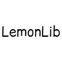

<center><div align="center">



# Lemon 🍋

LemonLib is a library that aims to add dynamic physics, rendering, and general utilities to make modding easier

[](https://github.com/Dusty-Development/Simplici/actions/workflows/build.yml)


## Contributing

Contributions are always welcome!

See `contributing.md` for ways to get started.

Please adhere to this project's `code of conduct`.

Please respect the mods license
[](https://www.apache.org/licenses/LICENSE-2.0)

#### How To Build The Mod

Clone the project

```bash
  git clone https://github.com/Dusty-Development/Simplici.git
```
or if your using github CLI
```bash
  gh repo clone Dusty-Development/Simplici
```

After you've cloned the repo

Go to the project directory

```bash
  cd my-project
```

open the project directory in a java ide such as [Intellij](https://www.jetbrains.com/idea/) or [Eclipse](https://eclipseide.org)

after gradle builds run the "runClient" gradle task for the desired launcher

## How to use
add this to your build.gradle file!

> <left><div align="left">
> ```gradle
> repositories {
>       maven { url 'https://jitpack.io' }
> }
> 
> dependencies {
>       modImplementation 'com.github.Dusty-Development:LemonLib:1.21.1-SNAPSHOT'
> }
> ```

## Authors

- [@Dustley](https://github.com/Dustley)
- [@HollowedWanderer](https://github.com/HollowedWanderer)
- [Dusty-Development Team](https://github.com/Dusty-Development/people)

#### 🔗 Links
[](https://www.youtube.com/channel/UC6_mejtQMMNBCyeju8Z0NpA)

## Credits

- [Dominion](https://github.com/dominion-dev/dominion-ecs-java) <- powerful ecs
